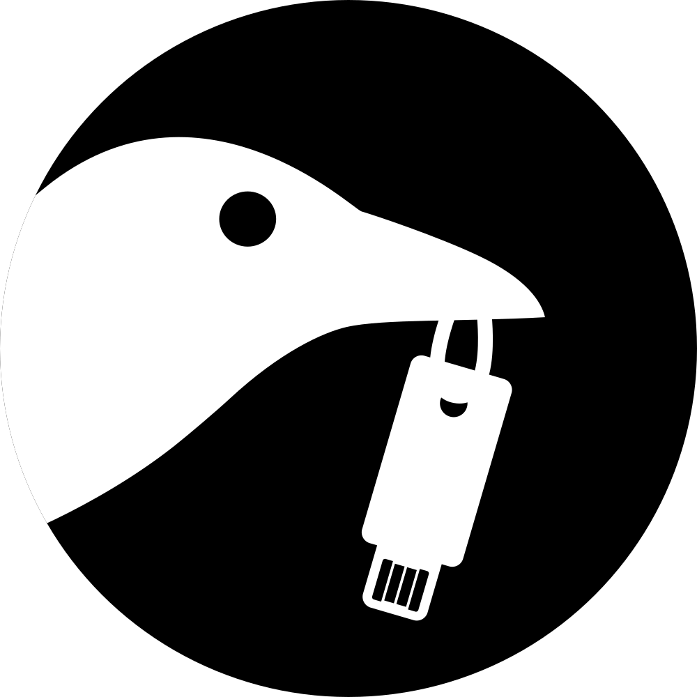
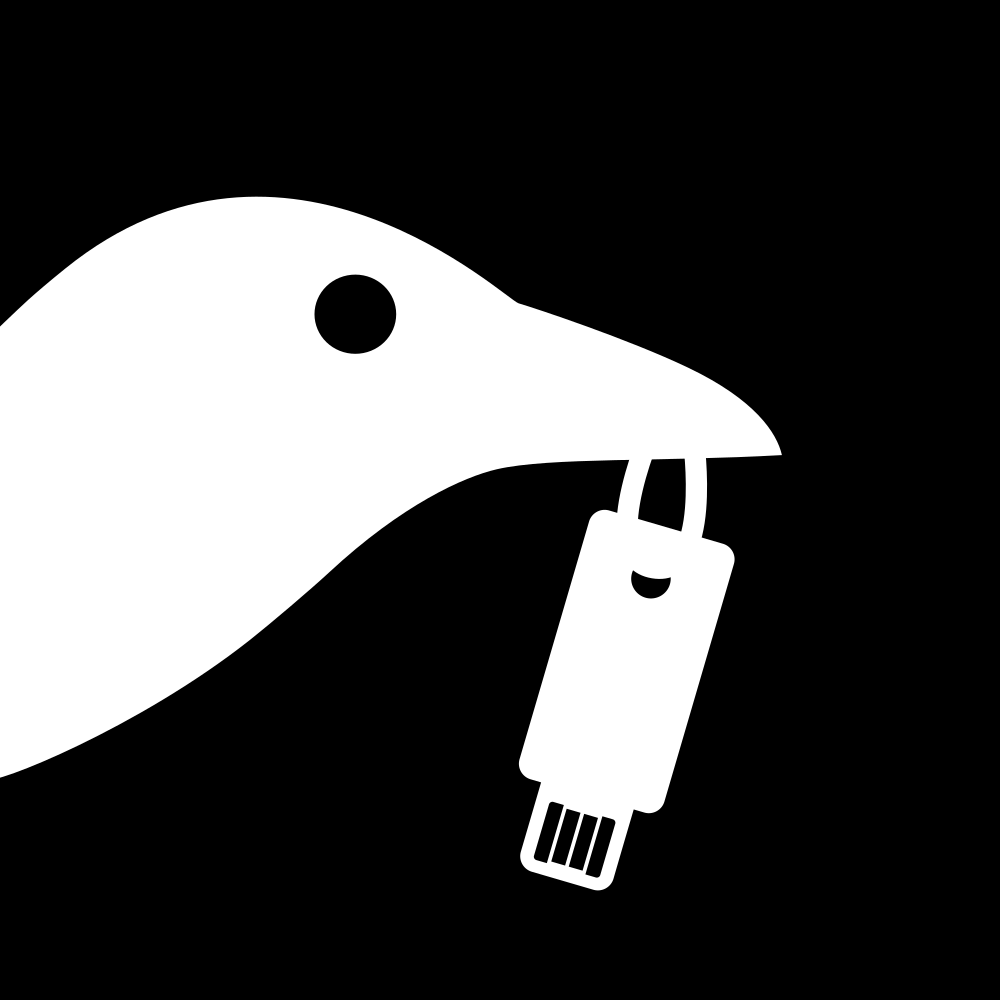
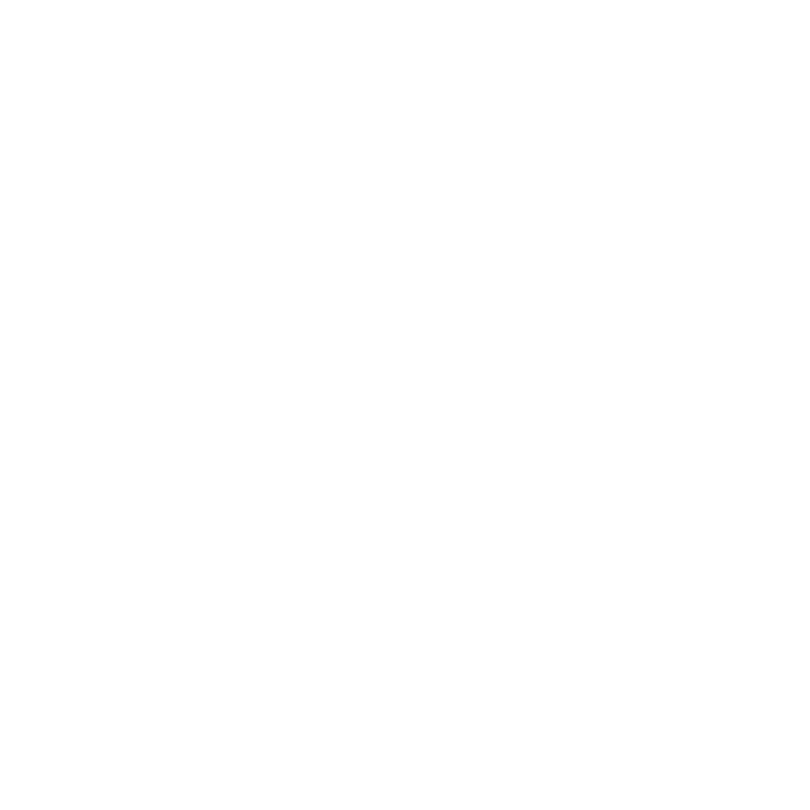

# Tartu Häkkerikoda logo - 2025
- **Author**: Oliver Jõgar
- **QA**: Mihkel Martin Kasterpalu
- **License**: The Unlicense - Public domain

## PNG files
> [!WARNING]
> Please do not create PNG files from the pure circle format SVGs, as it leaves ugly edges.
Use the version with margins for PNGs when possible. This issue does not apply to using SVGs directly.

|                            | Black on white                                                                         | Black on transparent                                                                | White on black                                                                         | White on transparent                                                                |
|----------------------------|----------------------------------------------------------------------------------------|-------------------------------------------------------------------------------------|----------------------------------------------------------------------------------------|-------------------------------------------------------------------------------------|
| Full format                | Omitted                                                                                | </img>         | Omitted                                                                                | </img>         |
| Square format              | </img>            | </img>            | </img>            | </img>            |
| Circle format with margins | </img> | </img> | </img> | </img> |

## SVG files
|                            | Black on white                                                                         | Black on transparent                                                                | White on black                                                                         | White on transparent                                                                |
|----------------------------|----------------------------------------------------------------------------------------|-------------------------------------------------------------------------------------|----------------------------------------------------------------------------------------|-------------------------------------------------------------------------------------|
| Full format                | Omitted                                                                                | </img>         | Omitted                                                                                | </img>         |
| Square format              | </img>            | </img>            | </img>            | </img>            |
| Circle format              | </img>            | </img>            | </img>            | </img>            |
| Circle format with margins | </img> | </img> | </img> | </img> |