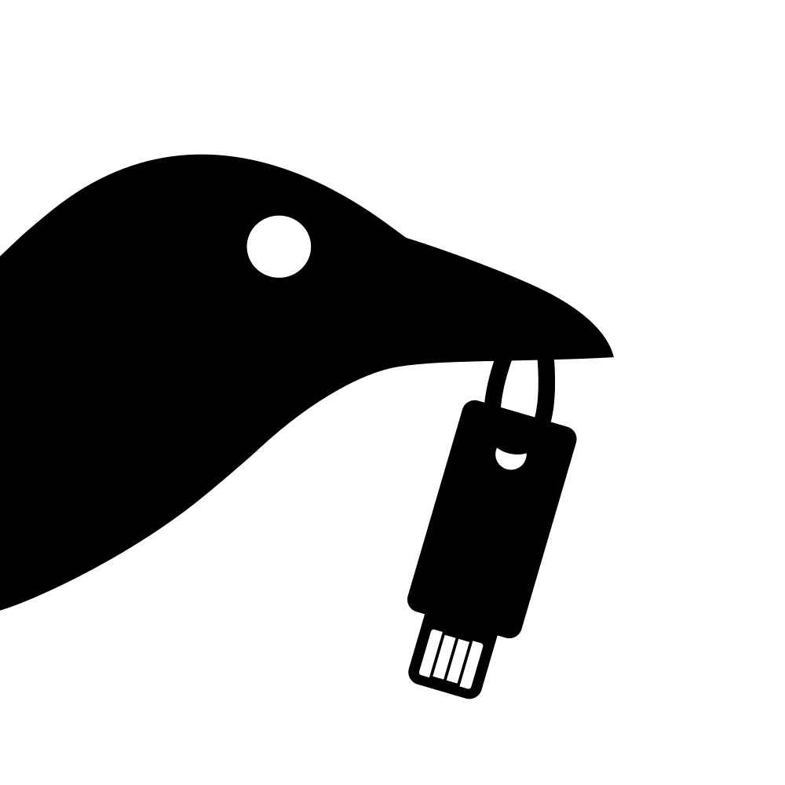
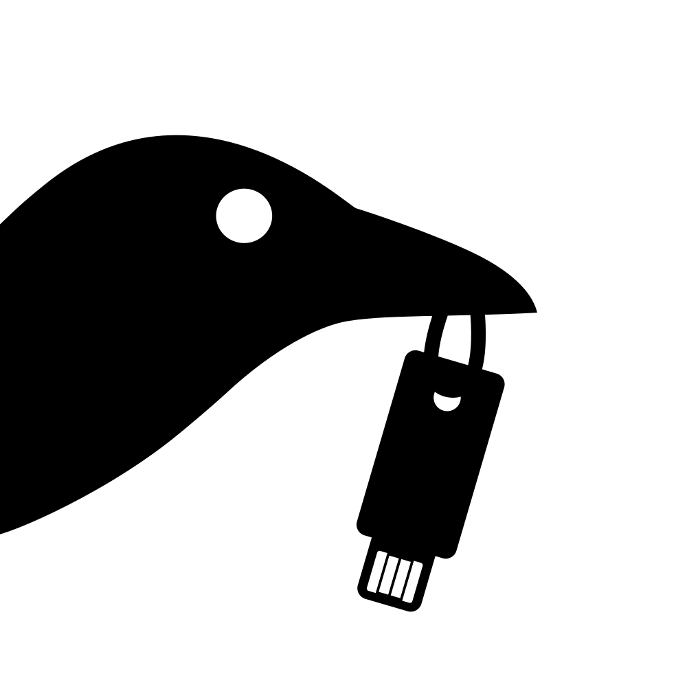
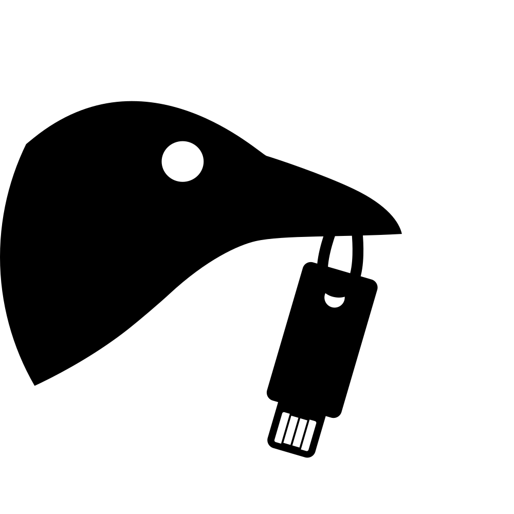
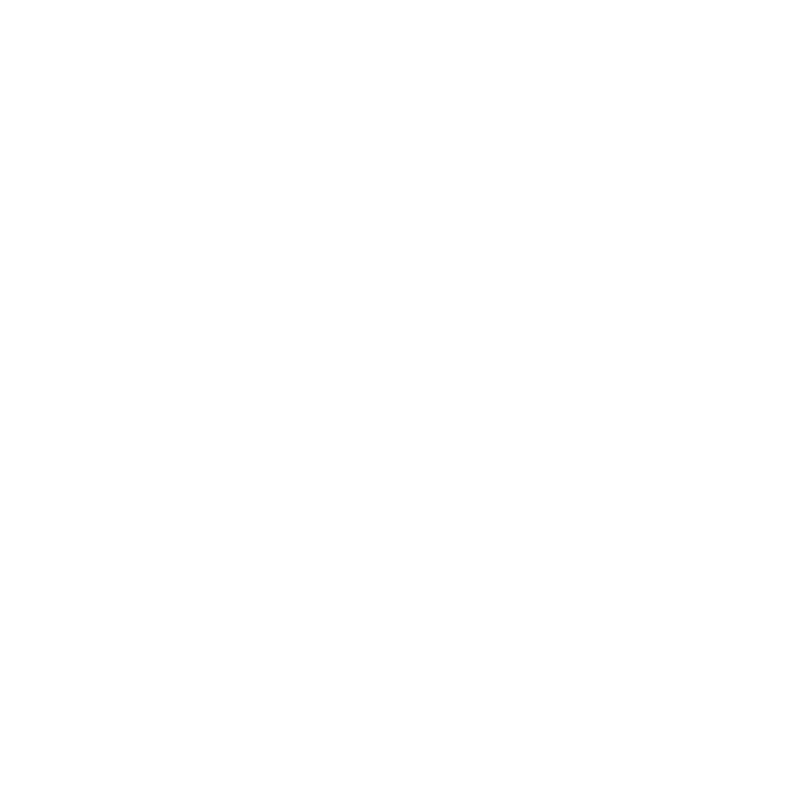

# Tartu Häkkerikoda logo - 2025
- **Autor**: Oliver Jõgar
- **QA**: Mihkel Martin Kasterpalu
- **Litsents**: The Unlicense - Avalik omand

## PNG failid
> [!WARNING]
> Palun mitte luua puhta ringi formaadiga SVG-st PNG faile, kuna see jätab koledad ääred. 
Kastutama peaks PNG puhul ainult koos veerisega versiooni kui võimalik. SVG enda kasutusel ei ole sama probleemi.

|                         | Must valgel                                                                            | Must tühjal                                                                         | Valge mustal                                                                           | Valge tühjal                                                                        |
|-------------------------|----------------------------------------------------------------------------------------|-------------------------------------------------------------------------------------|----------------------------------------------------------------------------------------|-------------------------------------------------------------------------------------|
| Ruudu formaat           | </img>            | </img>            | </img>            | </img>            |
| Ringi formaat veerisega | </img> | </img> | </img> | </img> |

## SVG failid
|                         | Must valgel                                                                            | Must tühjal                                                                         | Valge mustal                                                                           | Valge tühjal                                                                        |
|-------------------------|----------------------------------------------------------------------------------------|-------------------------------------------------------------------------------------|----------------------------------------------------------------------------------------|-------------------------------------------------------------------------------------|
| Ruudu formaat           | </img>            | </img>            | </img>            | </img>            |
| Ringi formaat           | </img>            | </img>            | </img>            | </img>            |
| Ringi formaat veerisega | </img> | </img> | </img> | </img> |